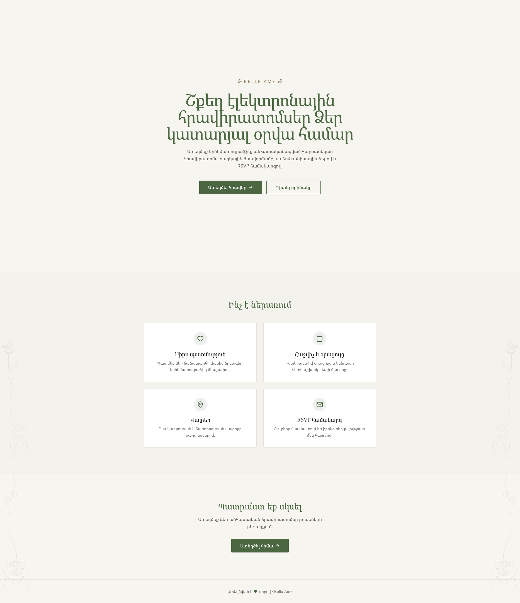
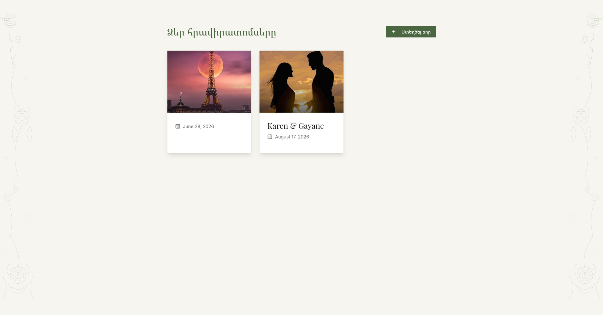
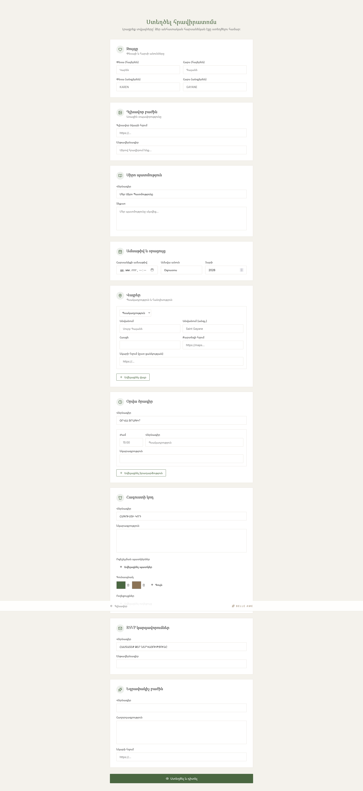
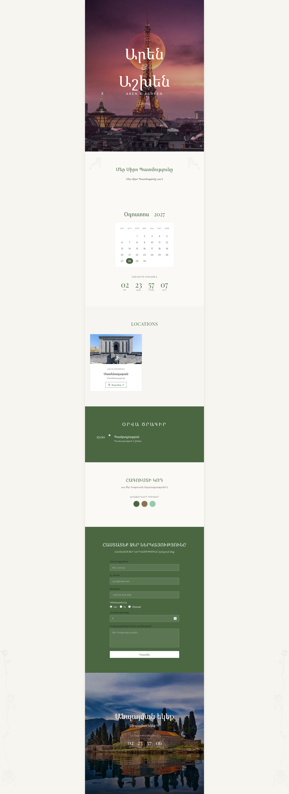
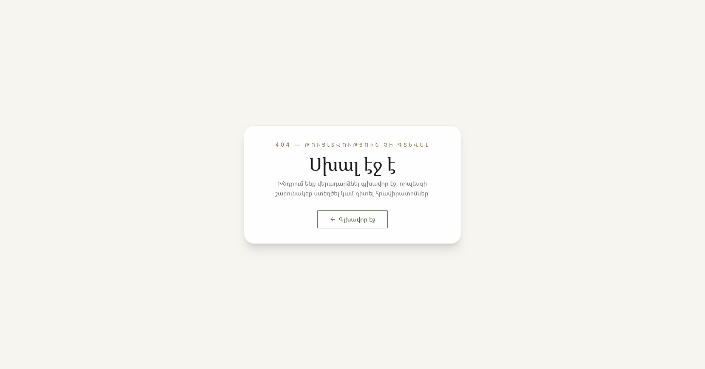

# Luxury Wedding Invitations Platform

A premium, full-stack digital invitation platform designed to provide an elegant, cinematic experience for wedding guests. The project features a powerful admin dashboard for creating custom invitations and a high-performance public interface for guest engagement.

## 🚀 Overview

* **Admin Portal**: Build sophisticated, custom wedding invitations with maps, timelines, dress codes, and RSVP management.
* **Guest Experience**: Cinematic, responsive, and interactive invitation pages with smooth animations and multi-language support.
* **Full-stack Architecture**: Built with a production-ready Node.js backend and a polished React frontend.

---

## 📸 Platform Preview

| Home Page | All Invitations | Create Invitation |
| :--- | :--- | :--- |
|  |  |  |

| Invitation Example | Error Handling |
| :--- | :--- |
|  |  |

---

## 🏗 Tech Stack

### Backend (`/server`)

* **Framework**: Node.js, Express
* **Database**: PostgreSQL with **Prisma ORM**
* **Auth**: JSON Web Tokens (JWT)
* **Media**: Cloudinary integration for secure image hosting
* **Validation**: Zod

### Frontend (`/client`)

* **Framework**: React 18, Vite
* **Styling**: TailwindCSS
* **Animations**: Framer Motion, Lenis Scroll
* **Forms**: React Hook Form, Zod validation

---

## 🛠 Quick Start

1. **Clone the repository:**
```bash
git clone https://github.com/KoryunNersisyan468/luxury-wedding.git
cd luxury-wedding

```


2. **Setup Backend (`/server`):**
* Copy `.env.example` to `.env` and configure your Database/Cloudinary keys.
* Run: `npm install`, `npm run prisma:generate`, and `npm run prisma:migrate:dev`.


3. **Setup Frontend (`/client`):**
* Copy the environment config and set `VITE_API_URL`.
* Run: `npm install` and `npm run dev`.


---

## 📝 Documentation

For deeper technical details, please refer to the specific documentation in each folder:

* [Backend API & Deployment](https://github.com/KoryunNersisyan468/luxury-wedding/blob/main/server/README.md)
* [Frontend Components & Setup](https://github.com/KoryunNersisyan468/luxury-wedding/blob/main/client/README.md)